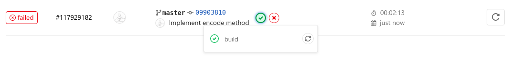
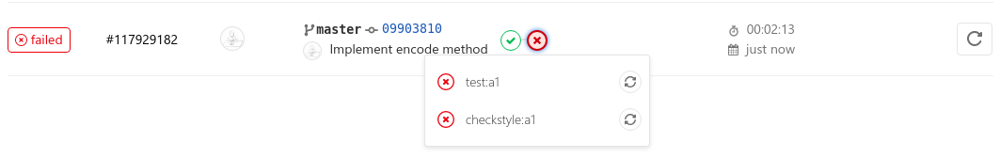
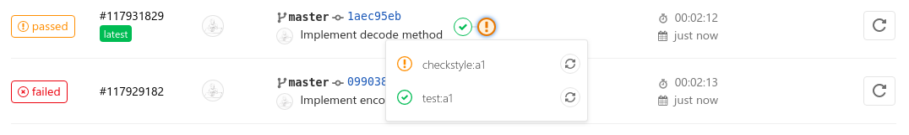
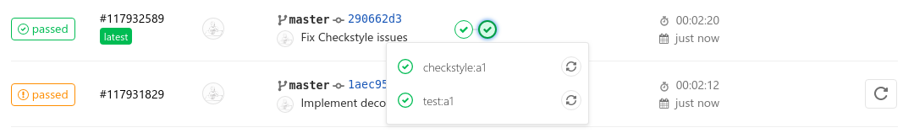

# Tugas Pemrograman

CSGE601021 Dasar-Dasar Pemrograman 2 @ Fakultas Ilmu Komputer Universitas Indonesia,
Semester Genap 2019/2020

* * *

## Daftar Isi

1. Soal Tugas Pemrograman
    1. [Tugas Pemrograman 1: Kode-Kode Privab][tp1]
2. [Memulai](#memulai)
3. [Mengerjakan Tugas Pemrograman](#mengerjakan-tugas-pemrograman)
4. [Mendapatkan pembaruan dari *upstream*](#mendapatkan-pembaruan-dari-upstream)
5. [Menyelesaikan konflik](#menyelesaikan-konflik)
6. [Penjelasan GitLab Pipelines](#penjelasan-gitlab-pipelines)
7. [Informasi kontak](#informasi-kontak)
8. [Atribusi](#atribusi)
9. [Lisensi](#lisensi)

## Memulai

1. [***Fork***][fork] repositori ini ke akun GitLab kamu.
2. Ubah visibilitas repositori hasil *fork* tersebut menjadi ***private*** melalui
   *Settings* (di sebelah kiri bawah) > *General* >
   *Visibility, project features, permissions* > *Project visibility* >
   *Private* > *Save changes*.
3. Tambahkan asdos kamu sebagai anggota di repositori kamu melalui *Settings* >
   *Members* dengan hak akses ***Maintainer***.
4. Kembali ke *Project overview*, klik tombol ***Clone*** yang ada di kanan atas.
5. Salin pranala (*link*) **HTTPS** (atau SSH jika kamu sudah mengaturnya) yang
   muncul.
6. Buka terminal/*shell* (misal: `cmd`, `bash`) di komputer kamu dan lakukan
   navigasi ke direktori yang kamu inginkan untuk menyimpan pekerjaan kamu.
7. ***Clone*** repositori kamu yang ada di GitLab ke komputer kamu menggunakan
   perintah **`git clone`**. Contoh:

    ```bash
    > git clone https://gitlab.com/DDP2-CSUI/2020/assignments.git tugas
    Cloning into 'tugas'...
    ```

    Catatan: nama direktori `tugas` bisa diganti sesuai keinginan kamu, atau
    bisa juga dihapus apabila ingin menggunakan nama direktori `assignments`.

8. Masuk ke direktori hasil *clone* yang baru saja selesai dan coba gunakan
   perintah **`git status`**. Contoh:

    ```bash
    > cd tugas
    tugas> git status
    On branch master
    nothing to commit, working tree clean
    ```

9. Tambahkan repositori ***remote*** bernama **`upstream`** yang mengarah ke
   [repositori pusat][repositori-pusat] (milik tim pengajar). Contoh:

    ```bash
    tugas> git remote add upstream https://gitlab.com/DDP2-CSUI/2020/assignments.git
    ```
    > Catatan: Sebuah git *remote* adalah sepasang alias dan pranala ke
    > suatu repositori. Secara *default*, repositori yang baru saja kamu *clone*
    > sudah punya sebuah *remote* bernama `origin` yang mengarah ke repositori
    > kamu di GitLab. Contoh di atas memberitahu repositori git lokal kamu
    > untuk melacak sebuah repositori git *remote* lainnya yang berada di
    > `https://gitlab.com/DDP2-CSUI/2020/assignments.git` dan menamainya `upstream`.

10. Nantinya, akan ada pembaruan pada repositori pusat (misalnya ada soal tugas
    baru atau revisi). Kamu bisa mendapatkan *commit* terbaru dari `upstream` dan
    menggabungkannya ke repositori lokal kamu menggunakan perintah **`git pull`**.
    Contoh:

    ```bash
    tugas> git pull upstream master
    From gitlab.com:DDP2-CSUI/2020/assignments
    Merge made by the 'recursive' strategy.
    ```

11. Apabila kamu ingin menyimpan pekerjaan ke repositori GitLab kamu, gunakan
    perintah **`git push`**. Perintah ini akan mengirimkan semua *commit* yang ada
    pada repositori lokal ke repositori di GitLab (jika *commit* tersebut belum ada).

    ```bash
    tugas> git push origin master
    Counting objects: 42, done.
    Delta compression using up to 8 threads.
    Compressing objects: 100% (37/37), done.
    Writing objects: 100% (42/42), 36.12 KiB | 1.57 MiB/s, done.
    Total 42 (delta 7), reused 0 (delta 0)
    To gitlab.com:<YOURNAME>/assignments.git
     * [new branch]      master -> master
    ```

    Pastikan kamu melakukan `push` ke *remote* **`origin`**, **bukan** `upstream`!

12. Kamu bisa memeriksa bahwa *commit* yang ada di repositori lokal kamu juga
    ada di repositori GitLab kamu.

13. Apabila kamu melakukan `push` dari komputer lain (atau repositori lokal lain),
    misalnya komputer lab, dan kamu ingin lanjut mengerjakan tugas di komputer kamu,
    kamu dapat menggunakan perintah `git pull origin master` untuk mendapatkan semua
    *commit* yang ada di GitLab dan belum ada di komputer kamu.

## Mengerjakan Tugas Pemrograman

1. Misalnya kamu ingin mengerjakan Tugas Pemrograman 1. Masuk ke direktori yang
   berisi soal tugas tersebut (contoh: `assignment1`).
2. **Baca** berkas `README.md` di dalam direktori `assignment1` dengan teliti.
3. Kerjakan tugas tersebut.
4. Gunakan `git add` atau `git reset` untuk *stage*/*unstage* berkas yang ingin
   di-*commit* ke repositori git kamu.
5. Ketika kamu ingin menyimpan progres, *commit* pekerjaan kamu ke repositori
   dengan command `git commit -m "<sebuah pesan commit>"`. Usahakan untuk
   mengikuti [panduan ini][panduan-commit] untuk menuliskan pesan *commit*
   yang baik.
6. Ulangi langkah 3-5 sampai kamu menyelesaikan tugas tersebut.
7. Ketika kamu sudah siap untuk mengumpulkan pekerjaan kamu (atau ingin
   menyimpan progres ke GitLab), lakukan `git push` seperti yang dicontohkan
   di atas.

## Mendapatkan pembaruan dari *upstream*

Jika ada pembaruan dari `upstream`, kamu bisa mendapatkan semua *commit*
terbaru dan menggabungkannya ke repositori git lokal kamu menggunakan perintah
`git pull upstream master` seperti yang dicontohkan di atas.

Jika kamu belum mengubah teks editor *default* yang digunakan oleh git, yakni
`vim`, akan muncul antarmuka `vim` yang memungkinkan kamu untuk mengubah pesan
*commit*. Jangan khawatir! Kamu bisa keluar dari `vim` dengan mengetik `:q`
lalu menekan <kbd>Enter</kbd>.

Jika kondisi `vim` kamu sudah dalam mode `INSERT`, kamu mungkin harus menekan
<kbd>Esc</kbd> terlebih dahulu. Jika kamu sudah mengubah isi pesan *commit*
dan ingin menyimpannya, kamu bisa mengetik `:wq` untuk menyimpan dan keluar
dari `vim`. Jika kamu tidak ingin menyimpan perubahan tersebut, kamu bisa
mengetik `:q!` untuk memaksa keluar dari `vim`.

## Menyelesaikan konflik

Jika terjadi *merge conflict*, silakan selesaikan konflik yang ada dan
lanjutkan proses *merging*. Kamu bisa cari [panduan][panduan-konflik] atau
meminta bantuan asdos jika mengalami kesulitan.

## Penjelasan GitLab Pipelines

Setelah kamu melakukan `git push`, GitLab akan otomatis menjalankan suatu
*pipeline* yang terdiri atas beberapa *stage*, dan setiap *stage* terdiri
atas beberapa *job*. Setiap *job* akan menjalankan serangkaian perintah
dalam suatu *runner* (seperti *virtual machine*) yang di dalamnya sudah
terinstal JDK 13 dan Gradle 6.1.1.

Sebagai contoh, ketika Tugas Pemrograman 1 dirilis, sebuah *pipeline* terdiri
atas 2 *stage*, yakni `build` dan `test`. Pada *stage* `build`, terdapat 1
*job*, yakni `build`. Pada *stage* `test`, terdapat dua *job*, yakni
`test:a1` dan `checkstyle:a1`.

Untuk ilustrasi, misalkan kamu baru mem-*fork* repositori ini. Lalu, kamu
mengerjakan *method* `encode` untuk Tugas Pemrograman 1. Ketika kamu *push*
kode kamu, kamu mungkin akan mendapatkan hasil seperti ini pada halaman
[*pipelines*][pipelines].



Centang hijau pada bulatan pertama artinya kode kamu berhasil melalui semua *job* di *stage* `build` (berhasil di-*compile* oleh GitLab Runner).



Silang merah pada bulatan kedua artinya kode kamu gagal melalui *stage*
`test`. Ini karena kamu belum mengimplementasikan *method* `decode`, sehingga
*job* `test:a1` yang menguji program kamu masih belum berhasil.

Misalnya sekarang kamu sudah berhasil mengimplementasikan *method* `decode`.
Kamu membuat *commit* baru dan mem-*push* pekerjaan kamu.



Tanda seru oranye pada bulatan kedua artinya kode kamu berhasil melalui semua
*job* wajib, tetapi ada *job* opsional yang gagal pada *stage* `test`. Dapat
dilihat bahwa *job* `test:a1` (wajib) sekarang sudah dicentang hijau, tetapi
*job* `checkstyle:a1` (opsional) memiliki tanda seru oranye.

Misalnya sekarang kamu sudah berhasil menyelesaikan pekerjaan opsional
(penyesuaian kode dengan aturan Checkstyle yang diterapkan). Kamu membuat
*commit* dan mem-*push* pekerjaan kamu.



Hore, sekarang semua *job* sudah dicentang hijau, dan status *pipeline* kamu
juga dicentang hijau! Artinya, kamu sudah menyelesaikan semua pekerjaan wajib
dan opsional pada **seluruh Tugas Pemrograman yang ada**.

## Informasi kontak

Jika kamu punya pertanyaan atau umpan balik terkait soal tugas pemrograman,
silakan gunakan [GitLab *Issues*][issues] pada repositori pusat. Kamu juga bisa
menghubungi tim pengajar secara langsung melalui informasi kontak yang
tersedia di SCeLE.

## Atribusi

Struktur Gradle multi-proyek dan isi berkas README utama diadaptasi dari
repositori [Tugas Pemrograman DDP2 2017/2018 Genap][repositori-2018].

## Lisensi

Hak cipta (c) 2020, Fakultas Ilmu Komputer Universitas Indonesia

Izin legal untuk menyalin, mengubah, dan membagikan pekerjaan dalam proyek ini
diatur dalam dua lisensi: [BSD 3-Clause][lisensi-bsd] dan
[Creative Commons Attribution-ShareAlike 4.0 (CC BY-SA 4.0)][lisensi-cc].
Kecuali disebutkan sebaliknya, lisensi BSD 3-Clause berlaku untuk kode sumber
(contoh: Java, YML, berkas konfigurasi), sedangkan CC BY-SA 4.0 berlaku untuk
dokumen teks dalam proyek ini.

Peraturan akademis, terutama terkait **plagiarisme**, tetap berlaku sebagaimana
yang telah dijelaskan dalam perkuliahan.

[tp1]: assignment1/README.md
[fork]: ../-/forks/new
[repositori-pusat]: https://gitlab.com/DDP2-CSUI/2020/assignments
[panduan-commit]: https://chris.beams.io/posts/git-commit
[panduan-konflik]: https://githowto.com/resolving_conflicts
[pipelines]: ../pipelines
[issues]: https://gitlab.com/DDP2-CSUI/2020/assignments/issues
[repositori-2018]: https://gitlab.com/DDP2-CSUI/assignment
[lisensi-bsd]: LICENSE
[lisensi-cc]: https://creativecommons.org/licenses/by-sa/4.0
